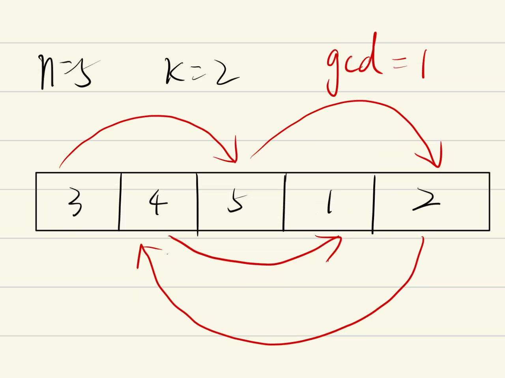

# [189. 轮转数组](https://leetcode.cn/problems/rotate-array/)

给定一个整数数组 `nums`，将数组中的元素向右轮转 `k` 个位置，其中 `k` 是非负数。

 

**示例 1:**

```
输入: nums = [1,2,3,4,5,6,7], k = 3
输出: [5,6,7,1,2,3,4]
解释:
向右轮转 1 步: [7,1,2,3,4,5,6]
向右轮转 2 步: [6,7,1,2,3,4,5]
向右轮转 3 步: [5,6,7,1,2,3,4]
```

**示例 2:**

```
输入：nums = [-1,-100,3,99], k = 2
输出：[3,99,-1,-100]
解释: 
向右轮转 1 步: [99,-1,-100,3]
向右轮转 2 步: [3,99,-1,-100]
```

 

**提示：**

- `1 <= nums.length <= 105`
- `-231 <= nums[i] <= 231 - 1`
- `0 <= k <= 105`

 

**进阶：**

- 尽可能想出更多的解决方案，至少有 **三种** 不同的方法可以解决这个问题。
- 你可以使用空间复杂度为 `O(1)` 的 **原地** 算法解决这个问题吗？


# 解答

## 1 辅助数组

```java
class Solution {
    public void rotate(int[] nums, int k) {
        int len=nums.length;
        k=k%len;
        int[] arr=new int[len];
        for(int i=0;i<len;i++){
            arr[(i+k)%len]=nums[i];
        }
        for(int i=0;i<len;i++){
            nums[i]=arr[i];
        }
    }
}
```

也可以使用`System.arraycopy(newArr, 0, nums, 0, n);`

**复杂度分析**

- 时间复杂度： *O*(*n*)，其中 *n* 为数组的长度。
- 空间复杂度： *O*(*n*)。

## 2 翻转

分析数组轮转的规则，发现：

以 *n*=7，*k*=3 为例进行如下展示：

| 操作                              | 结果          |
| --------------------------------- | ------------- |
| 原始数组                          | 1 2 3 4 5 6 7 |
| 翻转所有元素                      | 7 6 5 4 3 2 1 |
| 翻转 [0,*k*mod*n*−1] 区间的元素   | 5 6 7 4 3 2 1 |
| 翻转 [*k*mod*n*,*n*−1] 区间的元素 | 5 6 7 1 2 3 4 |

因此可以逐步的翻转数组：

```java
class Solution {
    public void reverse(int[] nums,int i,int k){
        while(i<=k){
            int temp=nums[i];
            nums[i]=nums[k];
            nums[k]=temp;
            i++;
            k--;
        }
    }
    public void rotate(int[] nums, int k) {
        int len=nums.length;
        k%=len;
        reverse(nums,0,len-1);
        reverse(nums,0,k-1);
        reverse(nums,k,len-1);
    }
}
```

**复杂度分析**

- 时间复杂度：*O*(*n*)，其中 *n* 为数组的长度。每个元素被翻转两次，一共 *n* 个元素，因此总时间复杂度为 *O*(2*n*)=*O*(*n*)。
- 空间复杂度：*O*(1)。


## 3 环形替换

方法一中使用额外数组的原因在于如果我们将每个数字放至它最后的位置，这样被放置位置的元素会被覆盖从而丢失。因此，从另一个角度，我们可以将替换的元素保存在变量 temp 中，从而避免了额外数组的开销。

我们从位置 0 开始，最初令 `temp = nums[0]`。根据规则，位置 0 的元素会放至 $(0 + k) \bmod n$ 的位置，令 $x = (0 + k) \bmod n$，此时交换 `temp` 和 `nums[x]`，完成位置 $x$ 的更新。然后，我们考察位置 $x$，并交换 `temp` 和 `nums[(x + k) \bmod n]`，从而完成下一个位置的更新。不断进行上述过程，直至回到初始位置 0。

容易发现，当回到初始位置 0 时，有些数字可能还没有遍历到，此时我们应该从下一个数字开始重复的过程，可是这个时候怎么才算遍历结束呢？我们不妨先考虑这样一个问题：从 0 开始不断遍历，最终回到起点 0 的过程中，我们遍历了多少个元素？

由于最终回到了起点，故该过程恰好走了整数数量的圈，不妨设为 $a$ 圈；再设该过程总共遍历了 $b$ 个元素。因此，我们有 $an = bk$，即 $an$ 一定为 $n, k$ 的公倍数。又因为我们在第一次回到起点时就结束，因此 $a$ 要尽可能小，故 $an$ 就是 $n, k$ 的最小公倍数 $lcm(n, k)$，因此 $b$ 就为 $lcm(n, k) / k$。

这说明单次遍历会访问到 $lcm(n, k) / k$ 个元素。为了访问到所有的元素，我们需要进行遍历的次数为

$$\frac{n}{lcm(n, k) / k} = \frac{nk}{lcm(n, k)} = gcd(n, k)$$

其中 $gcd$ 指的是最大公约数。




也可以使用单独的变量 *count* 跟踪当前已经访问的元素数量，当 *count*=*n* 时，结束遍历过程

```java
class Solution {
    public void rotate(int[] nums, int k) {
        int len=nums.length;
        int count=len;
        int index=0;
        k=k%len;
        while(count>0){
            int current=index;
            int prev=nums[current];
            int i=(index+k)%len;
            while(i!=current){
                int temp=nums[i];
                nums[i]=prev;
                prev=temp;
                i=(i+k)%len;
                count--;
            }
            nums[current]=prev;
            count--;
            index++;
        }
    }
}
```

注意这个部分：

```java
 			while(i!=current){
                int temp=nums[i];
                nums[i]=prev;
                prev=temp;
                i=(i+k)%len;
                count--;
            }
            nums[current]=prev;
            count--;
```

在while循环停止后，还有一个元素没有交换，需要手动交换

使用gcd：

```java
class Solution {
    public void rotate(int[] nums, int k) {
        int n = nums.length;
        k = k % n;
        int count = gcd(k, n);
        for (int start = 0; start < count; ++start) {
            int current = start;
            int prev = nums[start];
            do {
                int next = (current + k) % n;
                int temp = nums[next];
                nums[next] = prev;
                prev = temp;
                current = next;
            } while (start != current);
        }
    }

    public int gcd(int x, int y) {
        return y > 0 ? gcd(y, x % y) : x;
    }
}
```

**复杂度分析**

- 时间复杂度：*O*(*n*)，其中 *n* 为数组的长度。每个元素只会被遍历一次。
- 空间复杂度：*O*(1)。我们只需常数空间存放若干变量。