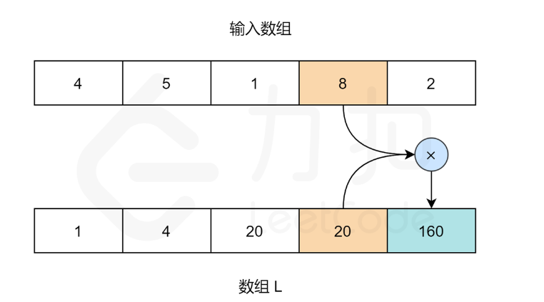

# [238. 除自身以外数组的乘积](https://leetcode.cn/problems/product-of-array-except-self/)

给你一个整数数组 `nums`，返回 数组 `answer` ，其中 `answer[i]` 等于 `nums` 中除 `nums[i]` 之外其余各元素的乘积 。

题目数据 **保证** 数组 `nums`之中任意元素的全部前缀元素和后缀的乘积都在 **32 位** 整数范围内。

请 **不要使用除法，**且在 `O(n)` 时间复杂度内完成此题。

 

**示例 1:**

```
输入: nums = [1,2,3,4]
输出: [24,12,8,6]
```

**示例 2:**

```
输入: nums = [-1,1,0,-3,3]
输出: [0,0,9,0,0]
```

 

**提示：**

- `2 <= nums.length <= 105`
- `-30 <= nums[i] <= 30`
- 输入 **保证** 数组 `answer[i]` 在 **32 位** 整数范围内

 

**进阶：**你可以在 `O(1)` 的额外空间复杂度内完成这个题目吗？（ 出于对空间复杂度分析的目的，输出数组 **不被视为** 额外空间。）


# 解答

## 1 使用两个数组记录状态量

有点类似**动态规划的接雨水**[42. 接雨水](https://leetcode.cn/problems/trapping-rain-water/)

将从左向右的乘积数组、从右向左的乘积数组保留下来，这样在计算任意一个位置的时候，直接使用`leftArr[i]*rightArr[i]`即可计算出来。



**算法**

1. 初始化两个空数组 `L` 和 `R`。对于给定索引 `i`，`L[i]` 代表的是 `i` 左侧所有数字的乘积，`R[i]` 代表的是 `i` 右侧所有数字的乘积。
2. 我们需要用两个循环来填充 `L` 和 `R` 数组的值。对于数组 `L`，`L[0]` 应该是 `1`，因为第一个元素的左边没有元素。对于其他元素：`L[i] = L[i-1] * nums[i-1]`。
3. 同理，对于数组 `R`，`R[length-1]` 应为 `1`。`length` 指的是输入数组的大小。其他元素：`R[i] = R[i+1] * nums[i+1]`。
4. 当 `R` 和 `L` 数组填充完成，我们只需要在输入数组上迭代，且索引 `i` 处的值为：`L[i] * R[i]`。

```java
class Solution {
    public int[] productExceptSelf(int[] nums) {
        int len=nums.length;
        int[] leftArr=new int[len];
        int[] rightArr=new int[len];
        leftArr[0]=1;
        rightArr[len-1]=1;
        for(int i=1;i<len;i++){
            leftArr[i]=nums[i-1]*leftArr[i-1];
            rightArr[len-i-1]=nums[len-i]*rightArr[len-i];
        }
        int[] res = new int[len];
        for(int i=0;i<len;i++){
            res[i]=leftArr[i]*rightArr[i];
        }
        return res;
    }
}
```

**复杂度分析**

- 时间复杂度：*O*(*N*)，其中 *N* 指的是数组 `nums` 的大小。预处理 `L` 和 `R` 数组以及最后的遍历计算都是 *O*(*N*) 的时间复杂度。
- 空间复杂度：*O*(*N*)，其中 *N* 指的是数组 `nums` 的大小。使用了 `L` 和 `R` 数组去构造答案，`L` 和 `R` 数组的长度为数组 `nums` 的大小。

## 2 优化一个数组 

对于两个数组来说，可以只保留一个数组，另一个数组在过程中动态的计算，因为计算的过程只和上一个元素有关系，所以可以这样计算出来。不过要求，顺序要从 **不使用额外数组的那一边开始计算，这样可以边计算边求值**

```java
class Solution {
    public int[] productExceptSelf(int[] nums) {
        int len=nums.length;
        int[] leftArr=new int[len];
        leftArr[0]=1;
        for(int i=1;i<len;i++){
            leftArr[i]=nums[i-1]*leftArr[i-1];
        }
        int right=1;
        for(int i=len-1;i>=0;i--){
            leftArr[i]=right*leftArr[i];
            right=nums[i]*right;
        }
        return leftArr;
    }
}
```

**复杂度分析**

- 时间复杂度：*O*(*N*)，其中 *N* 指的是数组 `nums` 的大小。分析与方法一相同。
- 空间复杂度：*O*(1)，输出数组不算进空间复杂度中，因此我们只需要常数的空间存放变量。

### 3 不符合题目的sum

```java
class Solution {
    public int[] productExceptSelf(int[] nums) {
        int len = nums.length;
        int zeroCount = 0;
        int zeroIndex = 0;
        int sum = 1;
        for (int i = 0; i < len; i++) {
            if (nums[i] == 0) {
                zeroCount++;
                zeroIndex = i;
            } else
                sum *= nums[i];
        }
        int[] res = new int[len];
        if (zeroCount > 1)
            return res;
        else if(zeroCount==1){
            res[zeroIndex]=sum;
            return res;
        }
        for(int i=0;i<len;i++){
            res[i]=sum/nums[i];
        }
        return res;
    }
}
```

纯暴力，并不符合题目意思