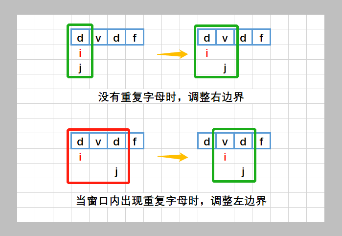

# [3. 无重复字符的最长子串](https://leetcode.cn/problems/longest-substring-without-repeating-characters/)

给定一个字符串 `s` ，请你找出其中不含有重复字符的 **最长** **子串**的长度。


 

**示例 1:**

```
输入: s = "abcabcbb"
输出: 3 
解释: 因为无重复字符的最长子串是 "abc"，所以其长度为 3。
```

**示例 2:**

```
输入: s = "bbbbb"
输出: 1
解释: 因为无重复字符的最长子串是 "b"，所以其长度为 1。
```

**示例 3:**

```
输入: s = "pwwkew"
输出: 3
解释: 因为无重复字符的最长子串是 "wke"，所以其长度为 3。
     请注意，你的答案必须是 子串 的长度，"pwke" 是一个子序列，不是子串。
```

 

**提示：**

- `0 <= s.length <= 5 * 104`
- `s` 由英文字母、数字、符号和空格组成


# 解答

## 1 哈希表

```java
class Solution {
    public int lengthOfLongestSubstring(String s) {
        int len = s.length();
        HashMap<Character, Integer> map = new HashMap<>();
        char[] arr = s.toCharArray();
        int maxLen = 0;
        int tailIndex = 0;
        for (int i = 0; i < len; i++) {
            if (!map.containsKey(arr[i])) {
                map.put(arr[i], i);
            } else if (map.containsKey(arr[i]) && map.get(arr[i]) < tailIndex) {
                map.put(arr[i], i);
            } else {
                int lastIndex = map.get(arr[i]);
                if (lastIndex >= tailIndex) {
                    map.put(arr[i], i);
                    tailIndex = lastIndex + 1;
                }
            }
            maxLen = Math.max(maxLen, i - tailIndex + 1);
        }
        return maxLen;
    }
}
```

使用哈希表辅助判断是否出现了一个相同的字符，如果出现了相同的字符，说明现在需要把tail(尾巴，也就是最左边的边界挪到相同字符的右边一个位置)，但是需要注意的是，**如果哈希表中存在了当前的字符，不一定代表一定要移动位置，因为这个位置可能已经在tail的左边去了（也就是被遗弃了），因此这个位置可以被更新为新的哈希中去**，也就是这段代码：

```java
else if (map.containsKey(arr[i]) && map.get(arr[i]) < tailIndex) {
                map.put(arr[i], i);
```

类似这个思路[参考](https://leetcode.cn/problems/longest-substring-without-repeating-characters/solutions/228576/longest-substring-without-repeating-characters-b-2/?envType=study-plan-v2&envId=top-100-liked)

### 思路

1. 滑动窗口，保证每个窗口里字母都是唯一的
   
2. 使用 `vector<int> m` 来记录一个字母如果后面出现重复时，`i` 应该调整到的新位置
   \21. 所以每次更新的时候都会保存 `j + 1` ，即字母后面的位置
3. `j` 表示子串的最后一个字母，计算子串长度为 `j - i + 1`

### 答题

C++

```cpp
    int lengthOfLongestSubstring(string s) {
        vector<int> m(128, 0);
        int ans = 0;
        int i = 0;
        for (int j = 0; j < s.size(); j++) {
            i = max(i, m[s[j]]);
            m[s[j]] = j + 1;
            ans = max(ans, j - i + 1);
        }
        return ans;
    }
```

拿数组代替了哈希表，那个数组记录的是每一个字符的上一次出现位置的下一个，这样当j移动到某个字符时，i会提前移动到这个数组记录的位置避免重复，然后再更新字符最新位置，

加上一句 if(m[s[j]]!=0) 更好理解，如果if(m[s[j]]!=0)表示新字符s[j]已经出现过，如果m[s[j]]<i表示新字符第一次出现在左指针左边，左指针i不变，如果m[s[j]]>=i，说明，这个重复字符在滑框中，需要将左指针i的位置变到第一次重复的字符的下一个，即i=m[s[j]]

## 写个注释便于你们理解[c++] 注意：我改了一些字母，做到名如其意

我看挺多人点赞回来更新一下注释：这个算法的思想有点像kmp(一种字符串匹配算法)，就是不要像传统滑窗一格一格挪，而是把窗口左边界直接跳到去除重复字符的位置

```cpp
class Solution {
public:
    int lengthOfLongestSubstring(string s) {
        // 创建桶(数组)，设定128个元素对应0-127ASCII码值
        // 每格都存对应字符的后一个位置，比如a的位置是i，那么数组里就存i+1
        // 用来在又碰见这个字符的时候把左边界直接更新到前一个该字符的下一个位置
        vector<int> m(128, 0);
        //存最大长度
        int maxlen = 0;
        //head表示窗口左边界位置
        int head = 0;
        //遍历字符串
        for (int i = 0; i < s.size(); i++) {
            //修改左边界，每次选最大的就相当于更新了
            head = max(head, m[s[i]]);
            //当前字母对应的ASCII码桶里存下一个位置(i+1)，用于更新左边界
            m[s[i]] = i + 1;
            //更新长度
            maxlen = max(maxlen, i - head + 1);
        }
        return maxlen;
    }
};
```


## 2 左右边界处理

- 我们使用两个指针表示字符串中的某个子串（或窗口）的左右边界，其中左指针代表着上文中「枚举子串的起始位置」，而右指针即为上文中的 *$r_k$*；
- 在每一步的操作中，我们会将左指针向右移动一格，表示 **我们开始枚举下一个字符作为起始位置**，然后我们可以不断地向右移动右指针，但需要保证这两个指针对应的子串中没有重复的字符。在移动结束后，这个子串就对应着 **以左指针开始的，不包含重复字符的最长子串**。我们记录下这个子串的长度；
- 在枚举结束后，我们找到的最长的子串的长度即为答案。

**判断重复字符**

在上面的流程中，我们还需要使用一种数据结构来判断 **是否有重复的字符**，常用的数据结构为哈希集合（即 `C++` 中的 `std::unordered_set`，`Java` 中的 `HashSet`，`Python` 中的 `set`, `JavaScript` 中的 `Set`）。在左指针向右移动的时候，我们从哈希集合中移除一个字符，在右指针向右移动的时候，我们往哈希集合中添加一个字符。

至此，我们就完美解决了本题。

```java
class Solution {
    public int lengthOfLongestSubstring(String s) {
        int len=s.length();
        char[] arr=s.toCharArray();
        HashSet<Character> set=new HashSet<>();
        int leftIndex=0;
        int res=0;
        for(int i=0;i<len;i++){
            while(set.contains(arr[i])){
                set.remove(arr[leftIndex]);
                leftIndex++;
            }
            set.add(arr[i]);
            res=Math.max(res,i-leftIndex+1);
        }
        return res;
    }
}
```

**复杂度分析**

- 时间复杂度：*O*(*N*)，其中 *N* 是字符串的长度。左指针和右指针分别会遍历整个字符串一次。
- 空间复杂度：*O*(∣Σ∣)，其中 Σ 表示字符集（即字符串中可以出现的字符），∣Σ∣ 表示字符集的大小。在本题中没有明确说明字符集，因此可以默认为所有 ASCII 码在 [0,128) 内的字符，即 ∣Σ∣=128。我们需要用到哈希集合来存储出现过的字符，而字符最多有 ∣Σ∣ 个，因此空间复杂度为 *O*(∣Σ∣)。

模板：

```cpp
//外层循环扩展右边界，内层循环扩展左边界
for (int l = 0, r = 0 ; r < n ; r++) {
	//当前考虑的元素
	while (l <= r && check()) {//区间[left,right]不符合题意
        //扩展左边界
    }
    //区间[left,right]符合题意，统计相关信息
}
```

本题：

```csharp
class Solution {
    public int lengthOfLongestSubstring(String s) {
        //滑动窗口
        char[] ss = s.toCharArray();
        Set<Character> set = new HashSet<>();//去重
        int res = 0;//结果
        for(int left = 0, right = 0; right < s.length(); right++) {//每一轮右端点都扩一个。
            char ch = ss[right];//right指向的元素，也是当前要考虑的元素
            while(set.contains(ch)) {//set中有ch，则缩短左边界，同时从set集合出元素
                set.remove(ss[left]);
                left++;
            }
            set.add(ss[right]);//别忘。将当前元素加入。
            res = Math.max(res, right - left + 1);//计算当前不重复子串的长度。
        }
        return res;
    }
}
```


官解

```java
class Solution {
    public int lengthOfLongestSubstring(String s) {
        // 哈希集合，记录每个字符是否出现过
        Set<Character> occ = new HashSet<Character>();
        int n = s.length();
        // 右指针，初始值为 -1，相当于我们在字符串的左边界的左侧，还没有开始移动
        int rk = -1, ans = 0;
        for (int i = 0; i < n; ++i) {
            if (i != 0) {
                // 左指针向右移动一格，移除一个字符
                occ.remove(s.charAt(i - 1));
            }
            while (rk + 1 < n && !occ.contains(s.charAt(rk + 1))) {
                // 不断地移动右指针
                occ.add(s.charAt(rk + 1));
                ++rk;
            }
            // 第 i 到 rk 个字符是一个极长的无重复字符子串
            ans = Math.max(ans, rk - i + 1);
        }
        return ans;
    }
}
```

