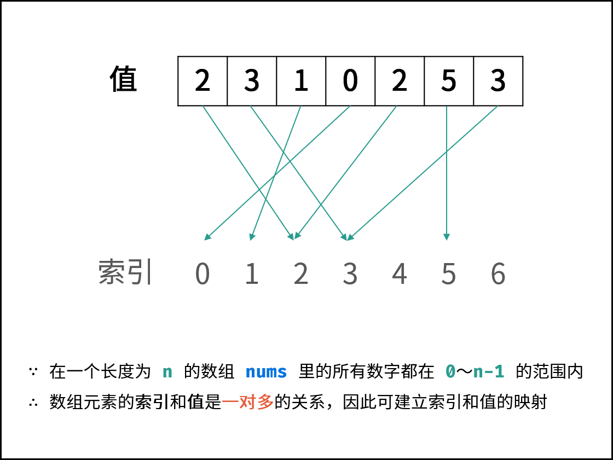

# [LCR 120. 寻找文件副本](https://leetcode.cn/problems/shu-zu-zhong-zhong-fu-de-shu-zi-lcof/)

设备中存有 `n` 个文件，文件 `id` 记于数组 `documents`。若文件 `id` 相同，则定义为该文件存在副本。请返回任一存在副本的文件 `id`。

 

**示例 1：**

```
输入：documents = [2, 5, 3, 0, 5, 0]
输出：0 或 5
```

 

**提示：**

- `0 ≤ documents[i] ≤ n-1`
- `2 <= n <= 100000`


# 解答

## 1 哈希表

```java
class Solution {
    public int findRepeatDocument(int[] documents) {
        int len=documents.length;
        HashSet<Integer> set=new HashSet<>();
        for(int i:documents){
            if(set.contains(i))return i;
            set.add(i);
        }
        return 0;
    }
}
```

边判断之前的元素是否放入，边放入新的元素，类似于 [1. 两数之和](https://leetcode.cn/problems/two-sum/)


## 2 数组作为哈希



```java
class Solution {
    public void swap(int[] nums,int i,int j){
        int temp=nums[i];
        nums[i]=nums[j];
        nums[j]=temp;
    }
    public int findRepeatDocument(int[] documents) {
        int len=documents.length;
        for(int i=0;i<len;i++){
            if(i==documents[i]){
                continue;
            }
            while(documents[documents[i]]!=documents[i]){
                swap(documents,documents[i],i);

            }
            if(documents[documents[i]]==documents[i]&&i!=documents[i]){
                return documents[i];
            }
        }
        return -1;
    }
}
```

注意条件判断：

```java
			while(documents[documents[i]]!=documents[i]){
                swap(documents,documents[i],i);

            }
            if(documents[documents[i]]==documents[i]&&i!=documents[i]){
                return documents[i];
            }
```

在第一个循环中，首先会将当前的元素全部归位，直到 出现已经归位的元素当于当前的元素，如果出现这个情况，并且当前的下标`i!=documents[i]`，则其一定是重复的元素


另一种写法更加直观：

```java
class Solution {
    public int findRepeatDocument(int[] documents) {
        int len=documents.length;
        int index=0;

        while(index<len){
            if(documents[index]==index){
                index++;
                continue;
            }
            if(documents[documents[index]]==documents[index]) return documents[index];
            swap(documents,index,documents[index]);
        }
        return -1;
    }
    public void swap(int[] nums,int i,int j){
        int temp=nums[i];
        nums[i]=nums[j];
        nums[j]=temp;
    }
}
```

如果出现一个元素，不在位置上，则交换，同时如果当前没交换已经是相同的，则证明已经重复了，返回

